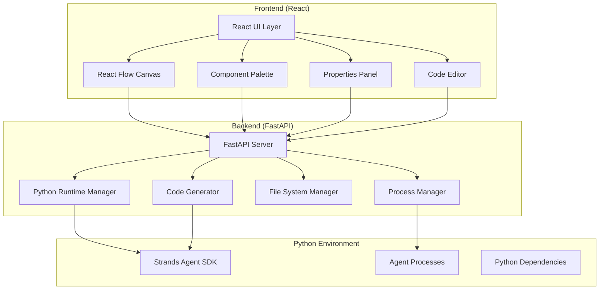

# Design Document

## Overview

The Agent Builder is a React-based visual editor that enables developers to create, configure, and test Strands Agent SDK agents through a drag-and-drop interface. The application leverages React Flow for the visual canvas and provides a comprehensive toolkit for agent development without requiring manual code writing.

The system follows a component-based architecture where each Strands Agent SDK component (agents, tools, models) is represented as a visual node that can be configured and connected to create complex agent workflows.

## Architecture

### High-Level Architecture



### Core Modules

#### Frontend Modules (React)

1. **Visual Editor Core**
   - React Flow integration for canvas management
   - Node and edge management
   - Drag and drop functionality
   - Canvas state management

2. **Component System**
   - Strands SDK component definitions
   - Node type registry
   - Component metadata and schemas
   - Visual representation mapping

3. **Configuration Management**
   - Property validation and editing
   - Schema-based configuration
   - Real-time validation
   - Configuration persistence

4. **API Client**
   - HTTP client for backend communication
   - WebSocket client for real-time updates
   - Request/response handling
   - Error handling and retry logic

#### Backend Modules (FastAPI)

5. **Code Generation Engine**
   - Workflow to Python code transformation
   - Strands SDK code generation
   - Dependency management
   - Code validation and syntax checking

6. **Runtime Integration**
   - Python agent execution
   - Process management and monitoring
   - Log streaming via WebSocket
   - Error handling and cleanup

7. **File System Management**
   - Workflow persistence (JSON/YAML)
   - Generated code storage
   - Project structure management
   - Import/export functionality

8. **Component Registry Service**
   - Strands SDK component discovery
   - Schema validation
   - Component metadata management
   - Dynamic component loading

## Components and Interfaces

### React Components

#### Core Canvas Components
```typescript
interface CanvasProps {
  nodes: Node[]
  edges: Edge[]
  onNodesChange: (changes: NodeChange[]) => void
  onEdgesChange: (changes: EdgeChange[]) => void
  onConnect: (connection: Connection) => void
}

interface AgentNode extends Node {
  type: 'agent' | 'tool' | 'model' | 'workflow'
  data: {
    component: StrandsComponent
    config: ComponentConfig
    validation: ValidationResult
  }
}
```

#### Component Palette
```typescript
interface ComponentPaletteProps {
  categories: ComponentCategory[]
  onDragStart: (component: StrandsComponent) => void
  searchFilter: string
}

interface StrandsComponent {
  id: string
  name: string
  category: 'agent' | 'tool' | 'model' | 'provider'
  description: string
  icon: string
  schema: JSONSchema
  defaultConfig: ComponentConfig
}
```

#### Properties Panel
```typescript
interface PropertiesPanelProps {
  selectedNode: AgentNode | null
  onConfigChange: (config: ComponentConfig) => void
  onValidation: (result: ValidationResult) => void
}

interface ComponentConfig {
  [key: string]: any
  // Dynamic configuration based on component schema
}
```

### Strands SDK Integration Layer

#### Component Registry
```typescript
interface ComponentRegistry {
  getAvailableComponents(): StrandsComponent[]
  getComponentSchema(componentId: string): JSONSchema
  validateConfiguration(componentId: string, config: ComponentConfig): ValidationResult
  createComponentInstance(componentId: string, config: ComponentConfig): any
}
```

#### Code Generator
```typescript
interface CodeGenerator {
  generateAgentCode(workflow: WorkflowDefinition): GeneratedCode
  validateWorkflow(workflow: WorkflowDefinition): ValidationResult
  getDependencies(workflow: WorkflowDefinition): string[]
}

interface GeneratedCode {
  code: string
  dependencies: string[]
  entryPoint: string
  configuration: any
}
```

#### API Client (Frontend)
```typescript
interface APIClient {
  // Workflow operations
  saveWorkflow(workflow: WorkflowDefinition): Promise<void>
  loadWorkflow(workflowId: string): Promise<WorkflowDefinition>
  
  // Code generation
  generateCode(workflow: WorkflowDefinition): Promise<GeneratedCode>
  validateWorkflow(workflow: WorkflowDefinition): Promise<ValidationResult>
  
  // Runtime operations
  executeAgent(code: GeneratedCode): Promise<AgentProcess>
  stopAgent(processId: string): Promise<void>
  getAgentStatus(processId: string): Promise<AgentStatus>
  
  // Component registry
  getAvailableComponents(): Promise<StrandsComponent[]>
  getComponentSchema(componentId: string): Promise<JSONSchema>
}

interface WebSocketClient {
  connectToAgentLogs(processId: string): Observable<LogEntry>
  connectToAgentStatus(processId: string): Observable<AgentStatus>
  disconnect(): void
}
```

#### Backend API Endpoints (FastAPI)
```python
# FastAPI endpoint definitions
@app.post("/api/workflows")
async def save_workflow(workflow: WorkflowDefinition) -> dict

@app.get("/api/workflows/{workflow_id}")
async def load_workflow(workflow_id: str) -> WorkflowDefinition

@app.post("/api/generate-code")
async def generate_code(workflow: WorkflowDefinition) -> GeneratedCode

@app.post("/api/execute-agent")
async def execute_agent(code: GeneratedCode) -> AgentProcess

@app.delete("/api/agents/{process_id}")
async def stop_agent(process_id: str) -> dict

@app.get("/api/components")
async def get_components() -> List[StrandsComponent]

@app.websocket("/ws/agent-logs/{process_id}")
async def agent_logs_websocket(websocket: WebSocket, process_id: str)
```

## Data Models

### Workflow Definition
```typescript
interface WorkflowDefinition {
  id: string
  name: string
  description: string
  nodes: AgentNode[]
  edges: WorkflowEdge[]
  metadata: WorkflowMetadata
  version: string
}

interface WorkflowEdge extends Edge {
  sourcePort: string
  targetPort: string
  dataType: string
  validation: EdgeValidation
}

interface WorkflowMetadata {
  created: Date
  modified: Date
  author: string
  tags: string[]
  dependencies: string[]
}
```

### Component Definitions
```typescript
interface AgentComponentDef extends StrandsComponent {
  type: 'agent'
  ports: {
    inputs: PortDefinition[]
    outputs: PortDefinition[]
  }
  systemPromptTemplate?: string
  defaultTools?: string[]
}

interface ToolComponentDef extends StrandsComponent {
  type: 'tool'
  functionSignature: FunctionSignature
  asyncSupport: boolean
  dependencies: string[]
}

interface ModelComponentDef extends StrandsComponent {
  type: 'model'
  provider: string
  capabilities: ModelCapability[]
  configSchema: JSONSchema
}
```

### Configuration Schemas
```typescript
interface PortDefinition {
  id: string
  name: string
  dataType: string
  required: boolean
  description: string
}

interface ValidationResult {
  isValid: boolean
  errors: ValidationError[]
  warnings: ValidationWarning[]
}

interface ValidationError {
  field: string
  message: string
  severity: 'error' | 'warning'
}
```

## Error Handling

### Validation Strategy
1. **Real-time Validation**: Validate configurations as users type
2. **Connection Validation**: Check port compatibility before allowing connections
3. **Workflow Validation**: Validate complete workflow before code generation
4. **Runtime Validation**: Validate generated code before execution

### Error Categories
```typescript
enum ErrorType {
  CONFIGURATION_ERROR = 'config_error',
  CONNECTION_ERROR = 'connection_error',
  VALIDATION_ERROR = 'validation_error',
  RUNTIME_ERROR = 'runtime_error',
  GENERATION_ERROR = 'generation_error'
}

interface ErrorHandler {
  handleError(error: AppError): void
  showUserFriendlyMessage(error: AppError): void
  logError(error: AppError): void
  recoverFromError(error: AppError): boolean
}
```

### Error Recovery
- Auto-save workflow state before operations
- Graceful degradation for non-critical errors
- User-friendly error messages with suggested fixes
- Rollback capabilities for failed operations

## Testing Strategy

### Unit Testing
- Component rendering and behavior
- Configuration validation logic
- Code generation accuracy
- Workflow serialization/deserialization

### Integration Testing
- React Flow integration
- Strands SDK component integration
- File system operations
- Runtime execution

### End-to-End Testing
- Complete workflow creation
- Code generation and execution
- Save/load functionality
- Error handling scenarios

### Test Structure
```typescript
describe('Agent Builder', () => {
  describe('Canvas Operations', () => {
    it('should create nodes from palette drag and drop')
    it('should connect compatible nodes')
    it('should prevent invalid connections')
  })
  
  describe('Code Generation', () => {
    it('should generate valid Strands SDK code')
    it('should include all required dependencies')
    it('should handle complex workflows')
  })
  
  describe('Runtime Integration', () => {
    it('should execute generated agents locally')
    it('should stream logs in real-time')
    it('should handle agent errors gracefully')
  })
})
```

### Component Categories for Strands SDK

Based on the research, the component palette will include:

1. **Agent Components**
   - Basic Agent
   - Specialized Agents (Math, Language, Research, etc.)
   - Orchestrator Agent

2. **Tool Components**
   - Calculator
   - File Operations (read, write)
   - HTTP Request
   - Shell Commands
   - Editor Tools
   - Current Time
   - Custom Tools

3. **Model Providers**
   - Anthropic (Claude)
   - OpenAI
   - Writer
   - SageMaker
   - Custom Models

4. **Multi-Agent Patterns**
   - Agents as Tools
   - Swarm
   - Graph/Workflow
   - Agent-to-Agent (A2A)

5. **Utility Components**
   - Content Blocks
   - Hooks
   - Executors (Sequential, Concurrent)

### Backend Technology Stack

#### FastAPI Backend
- **FastAPI**: Modern Python web framework for building APIs
- **Pydantic**: Data validation and serialization
- **WebSockets**: Real-time communication for logs and status
- **asyncio**: Asynchronous Python execution
- **subprocess**: Python process management for agent execution

#### Python Environment Management
- **Virtual Environment**: Isolated Python environment for each project
- **pip/poetry**: Dependency management
- **Strands Agent SDK**: Core agent framework
- **Process Monitoring**: Health checks and resource monitoring

### Communication Protocol

#### HTTP REST API
- Workflow CRUD operations
- Code generation requests
- Agent lifecycle management
- Component registry access

#### WebSocket Connections
- Real-time agent logs streaming
- Agent status updates
- Execution progress monitoring
- Error notifications

### Deployment Architecture

```mermaid
graph TB
    subgraph "Development Environment"
        ReactDev[React Dev Server :3000]
        FastAPIDev[FastAPI Server :8000]
        PythonEnv[Python Virtual Environment]
    end
    
    subgraph "Production Environment"
        ReactBuild[React Build (Static)]
        FastAPIProd[FastAPI Server]
        PythonProd[Python Environment]
        Nginx[Nginx Reverse Proxy]
    end
    
    ReactDev --> FastAPIDev
    FastAPIDev --> PythonEnv
    
    Nginx --> ReactBuild
    Nginx --> FastAPIProd
    FastAPIProd --> PythonProd
```

This design provides a comprehensive foundation for building the visual agent builder with proper separation between frontend and backend, enabling Python-based Strands Agent SDK execution while maintaining a modern React-based user interface.