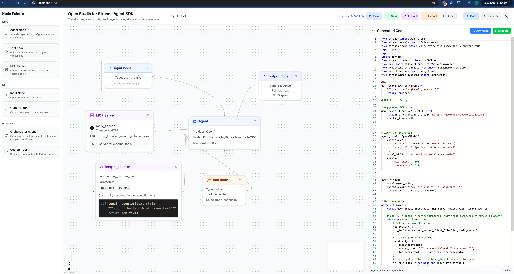
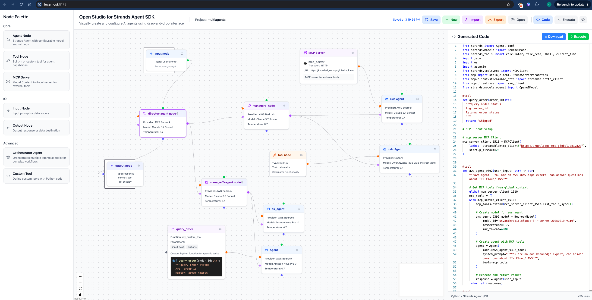
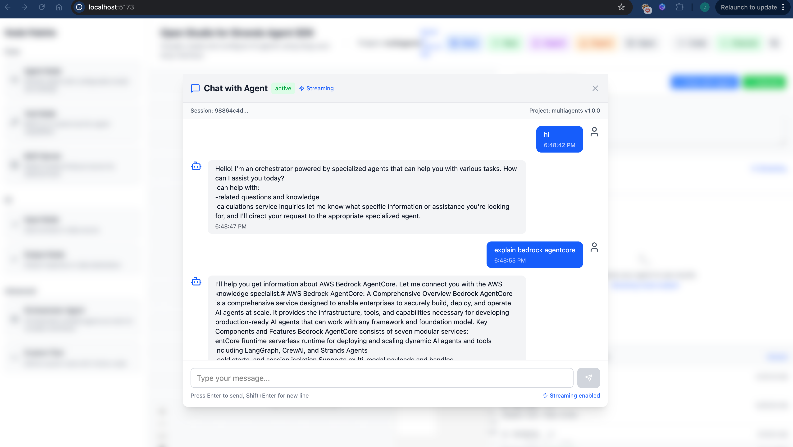
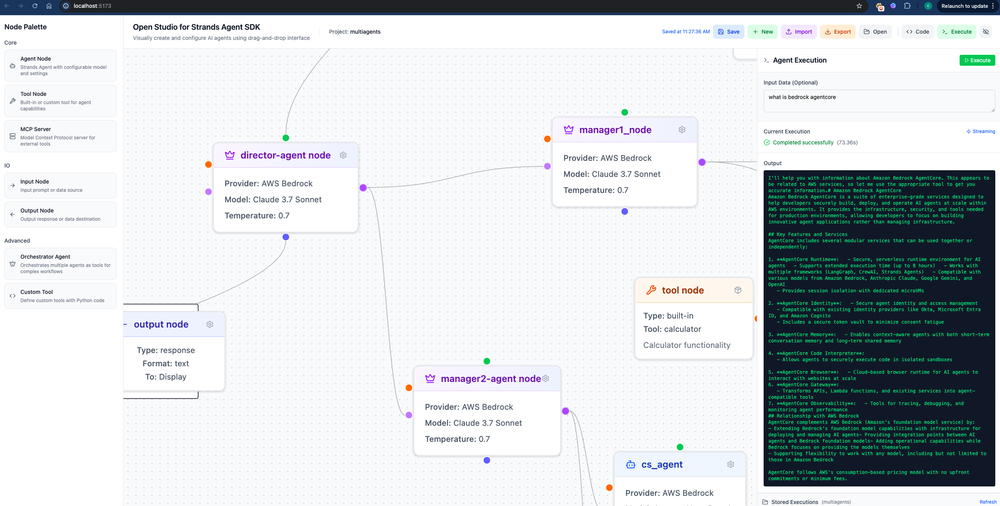

# Open Studio for Strands Agent SDK

A visual drag-and-drop interface for creating, configuring, and executing AI agent workflows. Build complex agent interactions through an intuitive node-based editor that generates Python code using the Strands Agent SDK.

⚠️ **Disclaimer: The Studio is NOT an official Amazon product - independent open-source project**

## Features

- **Visual Flow Editor**: Drag-and-drop interface for building agent workflows
- **Multi-Agent Support**: Create complex hierarchical agent workflows with orchestrator agents that coordinate sub-agents
- **Interactive Chat Interface**: Chat directly with your agents using full conversation history, streaming responses, and contextual memory across conversations
- **MCP Server Integration**: Connect to Model Context Protocol servers for extended tool capabilities
- **Custom Tool Nodes**: Define your own Python functions as reusable tools with @tool decorator
- **Multiple Model Providers**: Support for AWS Bedrock and OpenAI-compatible API endpoints
- **Code Generation**: Automatically generates Python code from visual flows
- **Real-time Execution**: Execute agents with streaming support and live updates
- **Project Management**: Save, load, and manage multiple agent projects with persistent local storage
- **Execution History**: Track and replay previous agent runs

## Demos
### Video
- Youtube: [Build AI Agent Teams Visually - No Code Required! 🤖 | Open Studio for Strands Agent](https://www.youtube.com/watch?v=lE6y6jM0b1Y)
- Wechat: [一款专为Strands Agent打造的无代码可视化编排工具](https://mp.weixin.qq.com/s/5KjbVRKAAGrRYQudLqlevg)

### 1. A single agent with MCP, builtin tool, custom tool


### 2. Hierarchy multi agents code generation


### 3. Interactive Chat with Agent

s
### 4. Hierarchy multi agents execution



## Quick Start

### Envrionment Setup

1. Install [Node Js 22](https://nodejs.org/en/download) 
2. Install [uv](https://docs.astral.sh/uv/getting-started/installation/)


### Development
```bash
# Start frontend development server
npm run dev

# Start backend server
npm run backend:dev

# Run both frontend and backend
npm run dev:full
```
### Try Interactive Chat Mode
1. Build any agent flow with input/output nodes
2. Click "Chat with Agent" in the execution panel
3. Have a natural conversation with your agent using streaming responses and full conversation history

### Play with sample flow
Download this sample [Flow](assets/sample_image.png) and import to the UI, and experience it.


### Production Deployment

#### Quick Start (Recommended)
```bash
# Start all services in production mode
./start_all.sh

# Stop all services
./stop_all.sh
```

#### Manual Commands
```bash
# Build for production
npm run build

# Build and preview frontend
npm run preview

# Start backend in production mode
cd backend && uv run uvicorn main:app --host 0.0.0.0 --port 8000

# Or use the npm script
npm run backend:prod
```

#### Production Features
- **Automated Setup**: `start_all.sh` handles dependency installation, building, and service startup
- **Background Execution**: Services run in the background with proper logging
- **Health Checks**: Automatic verification that services started successfully
- **Port Management**: Checks for port conflicts and provides warnings
- **Graceful Shutdown**: `stop_all.sh` properly stops all services and cleans up processes
- **Log Management**: Centralized logging in `logs/` directory
- **Secure Proxy Architecture**: Backend only accessible internally via Vite proxy
- **Single Port Exposure**: Only frontend port (5173) needs to be exposed
- **Cloud Deployment**: Auto-detects public IP for EC2 deployment
- **ALB Support**: Compatible with AWS Application Load Balancer

#### Deployment Architecture

The application uses a **secure proxy architecture** where:
- **Frontend** (port 5173): Publicly accessible, serves the React application
- **Backend** (port 8000): Internal only, proxied through frontend
- **All API requests** are automatically routed through the frontend to backend
- **Only port 5173** needs to be exposed in firewalls/security groups

#### Deployment Scenarios

##### Local Development
```bash
./start_all.sh
# Access: http://localhost:5173
# API Docs: http://localhost:5173/docs
```

##### Direct EC2 Deployment
```bash
./start_all.sh
# Auto-detects public IP (e.g., http://35.88.128.160:5173)
# API Docs: http://35.88.128.160:5173/docs
```

##### AWS ALB Deployment
```bash
export ALB_HOSTNAME=your-alb-hostname.us-west-2.elb.amazonaws.com
./start_all.sh
# Access: http://your-alb-hostname.us-west-2.elb.amazonaws.com:5173
# API Docs: http://your-alb-hostname.us-west-2.elb.amazonaws.com:5173/docs
```

#### Network Configuration

**Security Groups / Firewall Rules:**
- **Inbound**: Only allow port 5173 (frontend)
- **Port 8000**: Not exposed externally (backend is internal-only)

**Access URLs:**
- **Application**: `http://YOUR_HOST:5173`
- **API Documentation**: `http://YOUR_HOST:5173/docs` (proxied to backend)
- **Health Check**: `http://YOUR_HOST:5173/health` (proxied to backend)

#### Log Files
- Frontend logs: `logs/frontend.log`
- Backend logs: `logs/backend.log`

## Tech Stack

- **Frontend**: React 19, TypeScript, Vite, Tailwind CSS, XYFlow
- **Backend**: FastAPI, Python, Uvicorn
- **AI Agents**: Strands Agent SDK with support for AWS Bedrock and OpenAI-compatible models

## Architecture

The application consists of a React frontend for the visual editor and a FastAPI backend for code execution and conversation management. Projects are stored locally in the browser, while execution artifacts and conversation sessions are managed by the backend's file-based storage system. The chat interface provides real-time interaction with agents using full conversation history and streaming responses.

## Roadmap
### Nodes
- [x] Input Node
- [x] Output Node
- [x] Single Agent Node
- [x] Orchestrator Agent Node
- [x] MCP server node
- [x] Built tool node
- [x] Custom tool node
- [ ] Structural Output Node - to do 
- [ ] Swarm Agent Node - to do 

### Flows
- [x] Single agent mode
- [x] Agents as tool mode
- [ ] Graph mode - to do 
- [ ] Workflow mode - to do 

### Execution
- [x] Single turn execution run
- [x] Multi turns interactive chat mode

### Deployment
- [ ] One-click deploy to Bedrock AgentCore - in-progress 
- [ ] One-click deploy to Lambda - in-progress 
- [ ] One-click deploy to ECS Fargate - in-progress  
