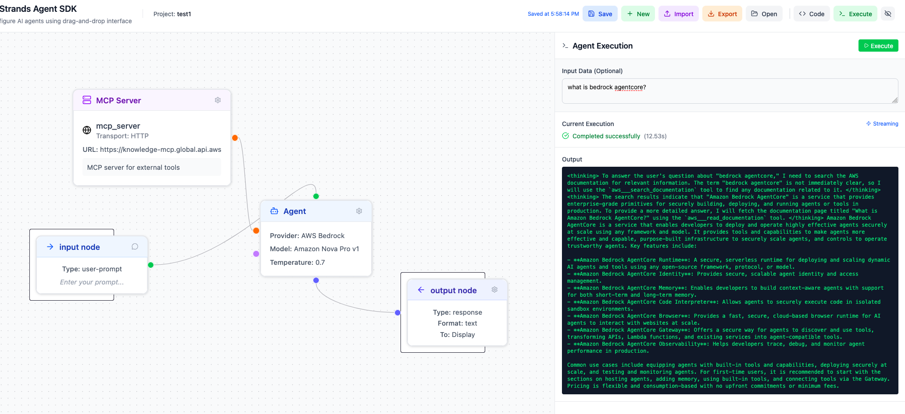

# Open Studio for Strands Agent SDK

A visual drag-and-drop interface for creating, configuring, and executing AI agent workflows. Build complex agent interactions through an intuitive node-based editor that generates Python code using the Strands Agent SDK.

⚠️ **Disclaimer: The Studio is NOT an official Amazon product - independent open-source project**

## Features

- **Visual Flow Editor**: Drag-and-drop interface for building agent workflows
- **Multi-Agent Support**: Create complex hierarchical agent workflows with orchestrator agents that coordinate sub-agents
- **Interactive Chat Interface**: Chat directly with your agents using full conversation history, streaming responses, and contextual memory across conversations
- **MCP Server Integration**: Connect to Model Context Protocol servers for extended tool capabilities
- **Custom Tool Nodes**: Define your own Python functions as reusable tools with @tool decorator
- **Multiple Model Providers**: Support for AWS Bedrock and OpenAI-compatible API endpoints
- **Code Generation**: Automatically generates Python code from visual flows
- **Real-time Execution**: Execute agents with streaming support and live updates
- **Project Management**: Save, load, and manage multiple agent projects with persistent local storage
- **Execution History**: Track and replay previous agent runs
- **One-Click Deployment**: Deploy agents to AWS Bedrock AgentCore or AWS Lambda Function with a single click

## Demos
### Video
- Youtube: [Build AI Agent Teams Visually - No Code Required! 🤖 | Open Studio for Strands Agent](https://www.youtube.com/watch?v=lE6y6jM0b1Y)
- Wechat: [一款专为Strands Agent打造的无代码可视化编排工具](https://mp.weixin.qq.com/s/5KjbVRKAAGrRYQudLqlevg)

### 1. A single agent with MCP, builtin tool, custom tool


### 2. Hierarchy multi agents code generation


### 3. Interactive Chat with Agent

s
### 4. Hierarchy multi agents execution


## Quick Start

### Envrionment Setup

1. Install [Node Js 22](https://nodejs.org/en/download) 
2. Install [uv](https://docs.astral.sh/uv/getting-started/installation/)


### Development
```bash
# Start frontend development server
npm run dev

# Start backend server
npm run backend:dev

# Run both frontend and backend
npm run dev:full
```
### Try Interactive Chat Mode
1. Build any agent flow with input/output nodes
2. Click "Chat with Agent" in the execution panel
3. Have a natural conversation with your agent using streaming responses and full conversation history

### Play with sample flow
Download this sample [Flow](assets/sample_image.png) and import to the UI, and experience it.


### Production Deployment

#### Quick Start (Recommended)
```bash
# Start all services in production mode
./start_all.sh

# Stop all services
./stop_all.sh
```

#### Manual Commands
```bash
# Build for production
npm run build

# Build and preview frontend
npm run preview

# Start backend in production mode
cd backend && uv run uvicorn main:app --host 0.0.0.0 --port 8000

# Or use the npm script
npm run backend:prod
```

#### Production Features
- **Automated Setup**: `start_all.sh` handles dependency installation, building, and service startup
- **Background Execution**: Services run in the background with proper logging
- **Health Checks**: Automatic verification that services started successfully
- **Port Management**: Checks for port conflicts and provides warnings
- **Graceful Shutdown**: `stop_all.sh` properly stops all services and cleans up processes
- **Log Management**: Centralized logging in `logs/` directory
- **Secure Proxy Architecture**: Backend only accessible internally via Vite proxy
- **Single Port Exposure**: Only frontend port (5173) needs to be exposed
- **Cloud Deployment**: Auto-detects public IP for EC2 deployment
- **ALB Support**: Compatible with AWS Application Load Balancer

#### Deployment Architecture

The application uses a **secure proxy architecture** where:
- **Frontend** (port 5173): Publicly accessible, serves the React application
- **Backend** (port 8000): Internal only, proxied through frontend
- **All API requests** are automatically routed through the frontend to backend
- **Only port 5173** needs to be exposed in firewalls/security groups

#### Deployment Scenarios

##### Local Development
```bash
./start_all.sh
# Access: http://localhost:5173
# API Docs: http://localhost:5173/docs
```

##### Direct EC2 Deployment
```bash
./start_all.sh
# Auto-detects public IP (e.g., http://35.88.128.160:5173)
# API Docs: http://35.88.128.160:5173/docs
```

##### AWS ALB Deployment
```bash
export ALB_HOSTNAME=your-alb-hostname.us-west-2.elb.amazonaws.com
./start_all.sh
# Access: http://your-alb-hostname.us-west-2.elb.amazonaws.com:5173
# API Docs: http://your-alb-hostname.us-west-2.elb.amazonaws.com:5173/docs
```

#### Network Configuration

**Security Groups / Firewall Rules:**
- **Inbound**: Only allow port 5173 (frontend)
- **Port 8000**: Not exposed externally (backend is internal-only)

**Access URLs:**
- **Application**: `http://YOUR_HOST:5173`
- **API Documentation**: `http://YOUR_HOST:5173/docs` (proxied to backend)
- **Health Check**: `http://YOUR_HOST:5173/health` (proxied to backend)

#### Log Files
- Frontend logs: `logs/frontend.log`
- Backend logs: `logs/backend.log`

## Agent Deployment

The Open Studio now supports **one-click deployment** of your agent workflows to AWS infrastructure, making it easy to move from development to production.

### Deployment Options

#### 1. AWS Bedrock AgentCore Deployment

Deploy your agent as a **Bedrock AgentCore** agent for serverless, managed AI agent execution.

**Features:**
- Fully managed agent runtime by AWS Bedrock
- Automatic scaling and high availability
- Integrated with AWS services (S3, DynamoDB, Lambda)
- Pay-per-use pricing model
- Built-in monitoring and logging via CloudWatch

**How to Deploy:**
1. Build your agent workflow in the visual editor
2. Click the "Deploy to AgentCore" button in the execution panel
3. Configure deployment settings (agent name, IAM role, etc.)
4. The system will automatically:
   - Generate the agent code
   - Package dependencies
   - Create CloudFormation stack
   - Deploy to Bedrock AgentCore
   - Provide the agent ARN for invocation

**Requirements:**
- AWS credentials configured (via AWS CLI or environment variables)
- Appropriate IAM permissions for Bedrock and CloudFormation
- Bedrock AgentCore enabled in your AWS region

#### 2. AWS Lambda Function Deployment

Deploy your agent as an **AWS Lambda Function** for serverless execution with HTTP API access.

**Features:**
- Serverless compute with automatic scaling
- HTTP API endpoint for agent invocation
- Support for synchronous and asynchronous execution
- Integration with API Gateway, EventBridge, and other AWS services
- Cost-effective pay-per-request pricing
- Built-in monitoring via CloudWatch Logs

**How to Deploy:**
1. Build your agent workflow in the visual editor
2. Click the "Deploy to Lambda" button in the execution panel
3. Configure deployment settings (function name, memory, timeout, etc.)
4. The system will automatically:
   - Generate the agent code with Lambda handler
   - Package dependencies into deployment package
   - Create CloudFormation stack with Lambda function and IAM role
   - Deploy to AWS Lambda
   - Provide the function ARN and invocation URL

**Requirements:**
- AWS credentials configured (via AWS CLI or environment variables)
- Appropriate IAM permissions for Lambda, IAM, and CloudFormation
- Sufficient Lambda quotas in your AWS account

### Deployment Architecture

Both deployment options use **AWS CloudFormation** for infrastructure as code, ensuring:
- Reproducible deployments
- Version control for infrastructure
- Easy rollback capabilities
- Automated resource cleanup

The deployment process:
1. **Code Generation**: Converts visual flow to production-ready Python code
2. **Dependency Packaging**: Bundles all required packages (Strands SDK, tools, etc.)
3. **CloudFormation Stack Creation**: Provisions AWS resources (Lambda/AgentCore, IAM roles, etc.)
4. **Deployment**: Uploads code and creates the agent/function
5. **Validation**: Verifies successful deployment and provides invocation details

### Managing Deployments

**View Deployment Status:**
- Use the AWS Console to monitor CloudFormation stacks
- Check CloudWatch Logs for execution logs
- View Lambda/AgentCore metrics in CloudWatch

**Update Deployment:**
- Make changes to your agent workflow
- Click deploy again with the same stack name to update

**Delete Deployment:**
- Delete the CloudFormation stack via AWS Console or CLI
- All associated resources will be cleaned up automatically

### Best Practices

1. **Use Separate AWS Accounts/Regions**: Deploy dev/staging/prod environments separately
2. **Configure Timeouts**: Set appropriate Lambda timeout values based on agent complexity
3. **Monitor Costs**: Use AWS Cost Explorer to track deployment costs
4. **Enable Logging**: CloudWatch Logs are enabled by default for debugging
5. **Secure Credentials**: Use IAM roles instead of hardcoded credentials in agent code
6. **Test Locally First**: Validate your agent workflow in the Studio before deploying

## Tech Stack

- **Frontend**: React 19, TypeScript, Vite, Tailwind CSS, XYFlow
- **Backend**: FastAPI, Python, Uvicorn
- **AI Agents**: Strands Agent SDK with support for AWS Bedrock and OpenAI-compatible models

## Architecture

The application consists of a React frontend for the visual editor and a FastAPI backend for code execution and conversation management. Projects are stored locally in the browser, while execution artifacts and conversation sessions are managed by the backend's file-based storage system. The chat interface provides real-time interaction with agents using full conversation history and streaming responses.

## Roadmap
### Nodes
- [x] Input Node
- [x] Output Node
- [x] Single Agent Node
- [x] Orchestrator Agent Node
- [x] MCP server node
- [x] Built tool node
- [x] Custom tool node
- [ ] Structural Output Node - to do 
- [x] Swarm Agent Node - to do 

### Flows
- [x] Single agent mode
- [x] Agents as tool mode
- [ ] Graph mode - to do 
- [ ] Workflow mode - to do 

### Execution
- [x] Single turn execution run
- [x] Multi turns interactive chat mode

### Deployment
- [x] One-click deploy to Bedrock AgentCore - done 
- [x] One-click deploy to Lambda - done 
- [ ] One-click deploy to ECS Fargate - in-progress  
